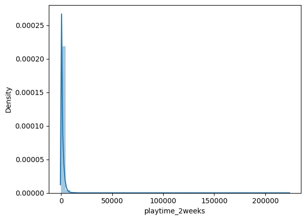
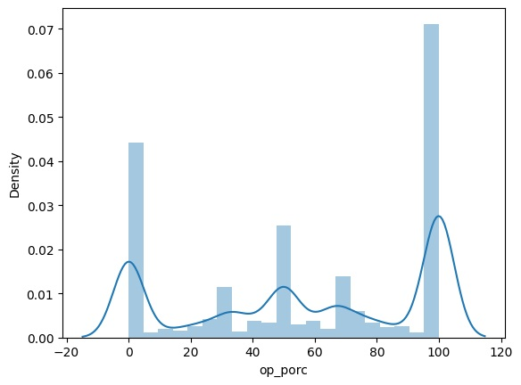
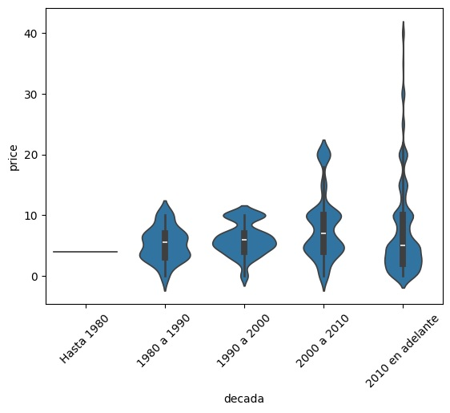
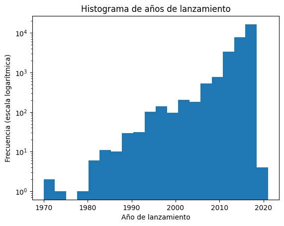
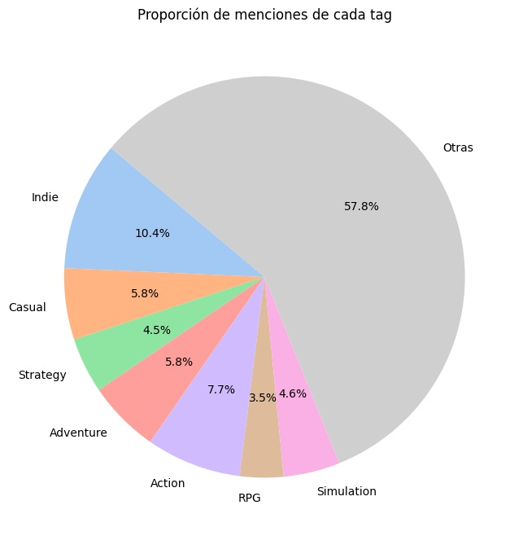
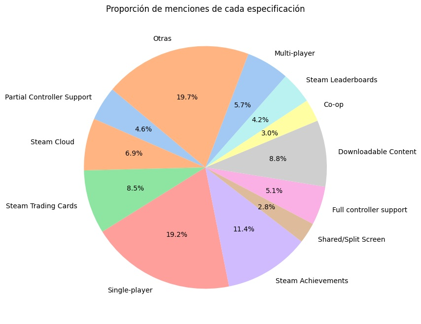
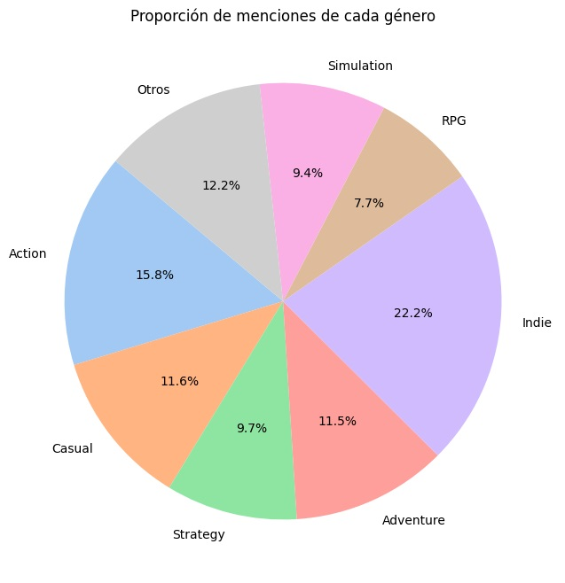
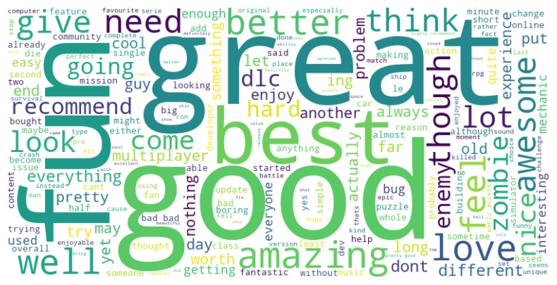
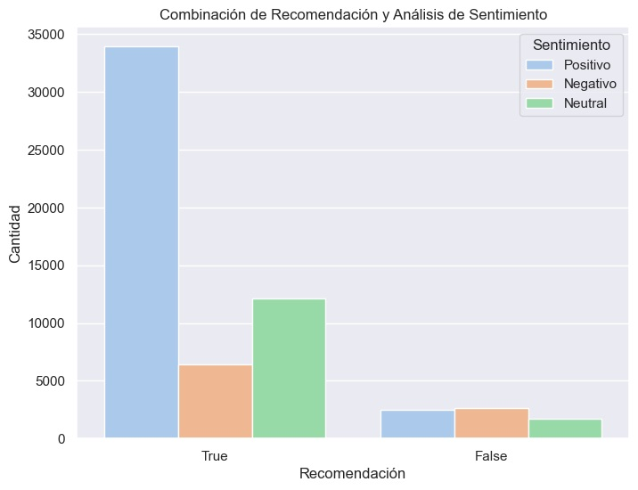
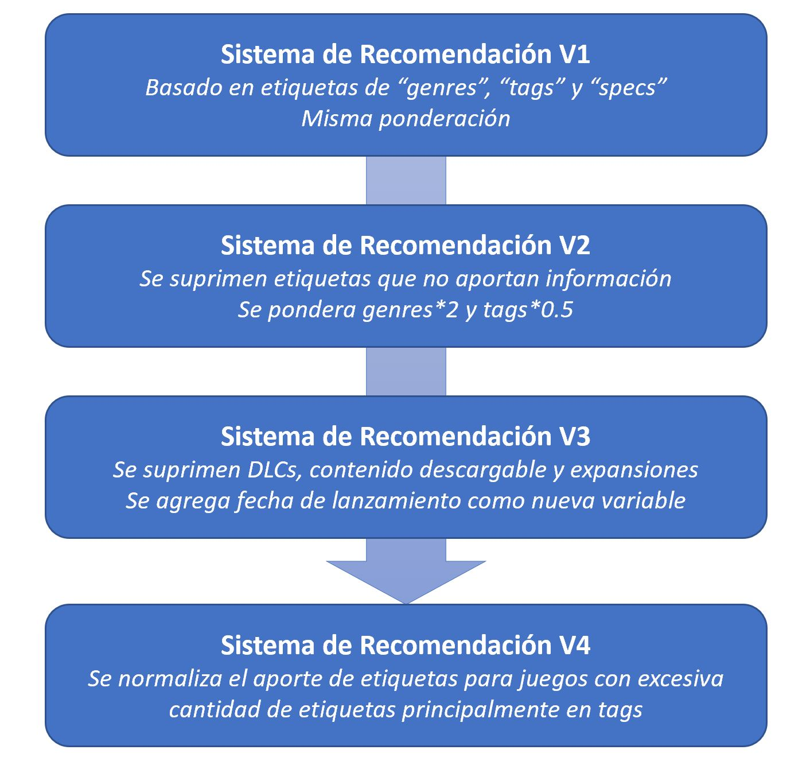

# PI_Henry_Urteaga
<h1 align="center"> Proyecto Individual Nº 1  </h1>
<h3 align="center"> Machine Learning Operations (MLOps) </h3>
<h3 align="center"> Autor: Bioing. Facundo Urteaga  </h3>

   
   

## Índice

*[Descripción del proyecto](#descripción-del-proyecto)

*[1_Extracción](#1-extraccion)

*[2_Transformación](#2-transformación)

*[3_EDA](#3-EDA)

*[4_Sentiment_Analysis](#4-sentiment-analysis)

*[5_Sistema_de_Recomendación](#5-sistema-de-recomendación)

*[6_Funciones_y_deploying](#6-funciones-y-deploying)

## Descripción del proyecto

Situación problemática: Como integrante del equipo de Data Science en Steam, se me ha encomendado la misión de desarrollar un sistema de recomendación de videojuegos para nuestros estimados usuarios. Sin embargo, al adentrarme en la exploración de los datos disponibles, me he percatado de un desafío que requiere nuestra atención: la madurez de los datos es, en términos generales, incipiente. Nos enfrentamos a archivos de datos sin procesar y desprovistos de estructura, y carecemos de mecanismos automatizados para mantenernos actualizados con los lanzamientos más recientes.
Este escenario plantea un reto significativo para la implementación exitosa de nuestro proyecto. No obstante, lo abordaremos como una oportunidad para demostrar nuestras habilidades de ingeniería de datos y establecer los cimientos de un Producto Mínimo Viable (MVP) que oriente nuestros esfuerzos. Aunque la tarea inicial pueda parecer desalentadora, estamos plenamente comprometidos a convertirla en un proyecto exitoso mediante una planificación cuidadosa y una ejecución precisa.
Con este enfoque, nos embarcamos en esta empresa con confianza y determinación, listos para superar los desafíos que surjan en el camino y alcanzar nuestros objetivos con éxito.
A continuación, la descripción de cada capítulo será coincidente con los scripts realizados para el trabajo y con el orden de procesamiento.

## 1 Extracción

La fase de extracción de datos implicó la implementación de funciones específicas para recuperar información de los archivos "users_items", "users_reviews" y "steam_games". Inicialmente, se planeó desarrollar una función general que pudiera utilizarse para los tres archivos; sin embargo, debido a las singularidades de cada uno, resultó necesario crear una función de extracción individual para cada archivo. Este proceso representó una de las etapas más extensas del proyecto, ya que implicó principalmente un enfoque de prueba y error basado en la verificación empírica. Los archivos originales en formato json, debido a su tamaño, no están incluídos en este repositorio, pero se puede acceder a ellos en el siguiente repositorio: https://drive.google.com/drive/folders/1HqBG2-sUkz_R3h1dZU5F2uAzpRn7BSpj

## 2 Transformación

En este proceso, se lleva a cabo el desanidado de columnas específicas que contenían datos anidados, la normalización y la limpieza general de los datos. Además, se realizan una serie de análisis que podrían considerarse una primera parte de EDA. Por ejemplo, identificar que el tiempo jugado por los usuarios  las últimas dos semanas (last_2_weeks) sea "lógico" (Figura 1), o que la distribución del porcentaje de opiniones positivas de los juegos tenga sentido (Figura 2).

   

   <em>Figura 1: Distribución de tiempo jugado las últimas dos semanas por usuario </em>

   

   <em>Figura 2: Densidad de opiniones positivas totales (de 0 a 100 %) </em>

## 3 EDA

En esta etapa se realiza el análisis exploratorio general, lo cual servirá para entender el comportamiento y el contexto de los datos antes de realizar las funciones y algoritmos posteriores. Dentro de esta etapa se destaca:
* La evolución de la distribución de precios segun las fechas de lanzamiento, donde se observa una tendencia de disminución del promedio de los precios en el paso de los años, pero a su vez por lógica los juegos más caros son los más actuales aunque sean los menos (Figura 3).
* El crecimiento exponencial (Se osberva como un crecimiento lineal ya que es el logaritmo de la frecuencia) de lanzamiento de juegos en el paso de los años (Figura 4).
* La cantidad de items por usuario, donde la mayoría contiene entre 10 y 100 items (Figura 5).
* Las etiquetas mas preponderantes de tags, specs y genres (Figuras 6, 7 y 8)

   

   <em>Figura 3: Violin Plot de precio de venta de los juegos por año de lanzamiento </em>

   

   <em>Figura 4: Cantidad de juegos lanzados a la plataforma por año </em>

   

   <em>Figura 5: Proporciones de tags </em>

   

   <em>Figura 6: Proporciones de specs </em>

   

   <em>Figura 7: Proporciones de genres </em>

## 4 Sentiment Analysis

Para realizar el análisis de sentimientos, se emplea la biblioteca NLTK en la etapa de tokenización de las frases. Este proceso es cíclico, ya que de manera empírica se observan palabras neutrales que se repiten con alta frecuencia y que no son tenidas en cuenta por la biblioteca de stopwords, siendo agregadas para reducir la carga de palabras en el posterior procesamiento. En esta etapa, nos apoyamos en herramientas como la nube de palabras (Figura 9). Posteriormente, para finalizar el análisis de sentimientos, se utilizan los métodos proporcionados por la función SentimentIntensityAnalyzer de la biblioteca Vader. Para evaluar el desempeño del algoritmo, se contrastan las reseñas positivas elaboradas por usuarios con el resultado del análisis de sentimientos. Lo que se debe observar principalmente en esta instancia es que las reseñas positivas coincidan con un análisis de sentimientos positivo en la mayoría de los casos (Figura 10).

   

   <em>Figura 9: Nube de palabras </em>

   

   <em>Figura 10: Comparación entre reseñas y análisis de sentimiento </em>

## 5 Sistema de Recomendación

Se realiza un sistema de recomendación basado en Videojuego. El algoritmo recibe un videojuego y recomienda otros cinco de similares características. Se desarrolló un modelo basado en el algoritmo K Vecinos mas Cercanos y utilizando como métrica la similitud del coseno. Se detallan a continuación las distintas versiones del modelo con sus características y modificaciones respecto a las versiones previas. El desempeño de los modelos se evaluó a partir de una selección de videojuegos clásicos y variados en cuanto a género, época y características. Se utiliza como modelo final la cuarta versión (V4) (Figura 11).

   

   <em>Figura 11: Sistema de Recomendación. Versiones </em>

* V1: Modelo inicial. Se utilizan las etiquetas de "genres", "tags" y "specs" como variables dummies (1 presencia, 0 ausencia) y se entrena el modelo. El desempeño de este modelo es regular
* V2: Segunda Versión. Se eliminan algunas etiquetas, principalmente de "tags" y "specs" que, a criterio del científico de datos, no aportan información y pueden generar confusión al momento de clasificar. Esto se debe a que son etiquetas extrañas y que no suelen discriminar la preferencia o no de un Usuario al momento de elegir un videojuego. Además se pondera genres*2 debido a que las etiquetas en general son pocas pero mas concretas en relación al estilo del videojuego. Ocurre lo contrario con tags que es penalizado en un factor de 0.5 debido a la cantidad de etiquetas que poseen en general los videojuegos, y además, por un estudio mas metódico, se descubre que estas etiquetas son definidas por usuarios y en muchos casos no corresponden a las carecterísticas del videojuego. Un ejemplo sencillo es el juego de fútbol PES 2018 que posee la etiqueta de "Gore" y "Heist". El desempeño de este modelo es aceptable
* V3: Tercera Versión. Se elimina el contenido descargable, DLCs y expansiones, ya que en general no deseamos que se recomiende ese tipo de producto. Además, se agrega como variable la fecha de lanzamiento (agrupada en lustros) ya que en general los usuarios suelen desear conocer videojuegos de una misma época. De todas maneras esto no es exclusivo, por lo que se agrega como una variable mas que afecte moderadamente al sistema de recomendación. El desempeño de este modelo es muy bueno
* V4: Cuarta Versión. Al observar que en general los videojuegos tienen pocas etiquetas "genres" y muchas etiquetas "specs" y "tags", entendiendo que las etiquetas "genres" son las mas valiosas y representativas del videojuego y, por último, sabiendo que al valer todas las etiquetas lo mismo, la influencia de pocas etiquetas "genres" se vería diluída por muchas etiquetas "specs" o "tags" se procede a penalizar la influencia de estas últimas a partir de dividir cada etiqueta por el total de etiquetas en su categoría. Entonces, por ejemplo, si el videojuego posee 10 etiquetas "tags", cada una pasaría a valer 1/10 o 0.1 en lugar de 1. El desempeño de este modelo es excelente.

### Desempeño del modelo

Indices de prueba. Juegos de diferentes características (Los simbolos ++ o -- indican un cambio positivo o negativo respecto al desempeño del modelo anterior)

------- JUEGO ---------|---id---|-Desempeño--------------
-----------------------|--------|------------------------
Counter Strike         |     10 | muy bien
PES 2018               | 592580 | muy bien ++
AGE III                | 105450 | muy bien
Simcity 4              |  24780 | muy bien
Tennis Elbow 2013      | 346470 | regular (falta que recomiende otros juegos de tennis)
Civilization IV        |  16810 | excelente
Darksiders             |  50620 | excelente
Fallout NV             |  22380 | muy bien ++ (pueden faltar juegos de la franquicia)
Dragon Age Origins     |  47810 | excelente
Star Wars Jedi Knight  |   6020 | excelente ++
NFS Shift              |  24870 | excelente ++
Final DOOM             |   2290 | excelente
Earthworm Jim          | 901147 | muy bien   

## 6 Funciones y deploying
